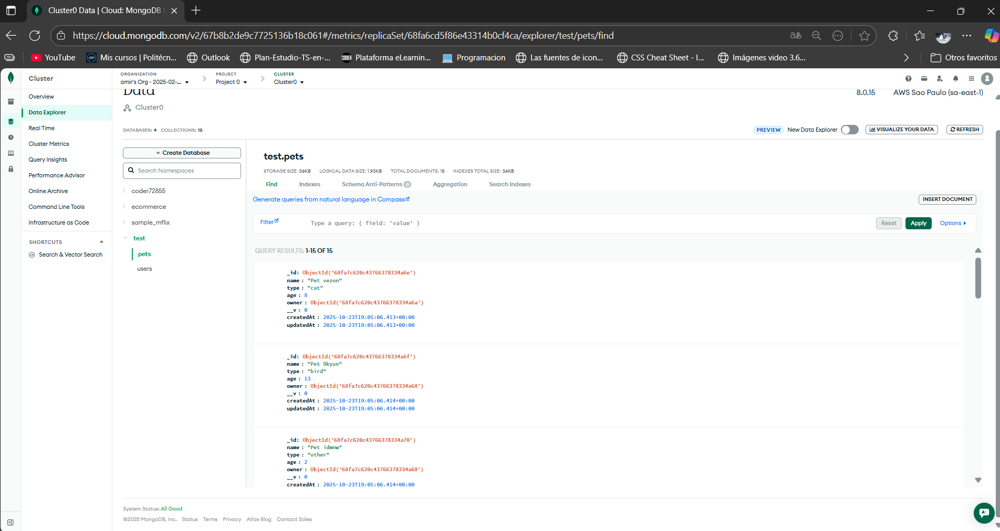
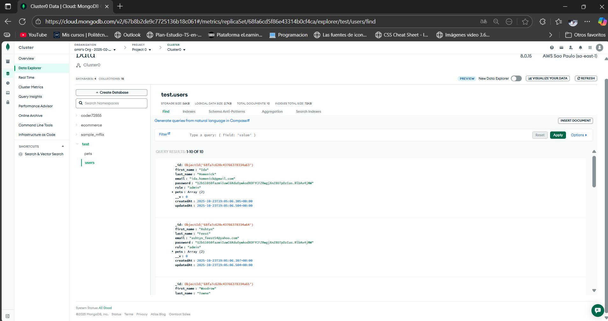

# 🧩 Entrega N°1 – Proyecto Backend III

Este proyecto cumple con la **Entrega N°1** del curso de Backend III.  
El objetivo fue implementar un sistema de generación de datos simulados (mocking) utilizando **Express**, **Faker**, **Mongoose** y **MongoDB Atlas**.

---

## ⚙️ Tecnologías utilizadas
- Node.js  
- Express  
- MongoDB Atlas  
- Mongoose  
- Faker.js  
- Bcrypt  
- Dotenv  

---

## 📁 Estructura del proyecto

src/
├─ models/
│ ├─ pet.model.js
│ └─ user.model.js
├─ routes/
│ ├─ mocks.router.js
│ ├─ pets.router.js
│ └─ users.router.js
├─ utils/
│ └─ mocking.js
└─ app.js
imagenes_mongo/
├─ test_pets.png
└─ test_users.png
.env
package.json
README.md

---

## 🚀 Endpoints principales

### 🔹 `/api/mocks/mockingpets`
Genera mascotas falsas (mocking) sin guardarlas en base de datos.

### 🔹 `/api/mocks/mockingusers`
Genera **50 usuarios simulados** con los siguientes campos:
- Contraseña encriptada (`"#"`)
- Role: `"user"` o `"admin"`
- Array vacío de `pets`

### 🔹 `/api/mocks/generateData`  *(POST)*
Genera e **inserta** usuarios y mascotas en MongoDB Atlas.

 ### 📸 Colección `pets`


### 📸 Colección `users`


#### Ejemplo de body:
```json
{
  "users": 20,
  "pets": 30
}


