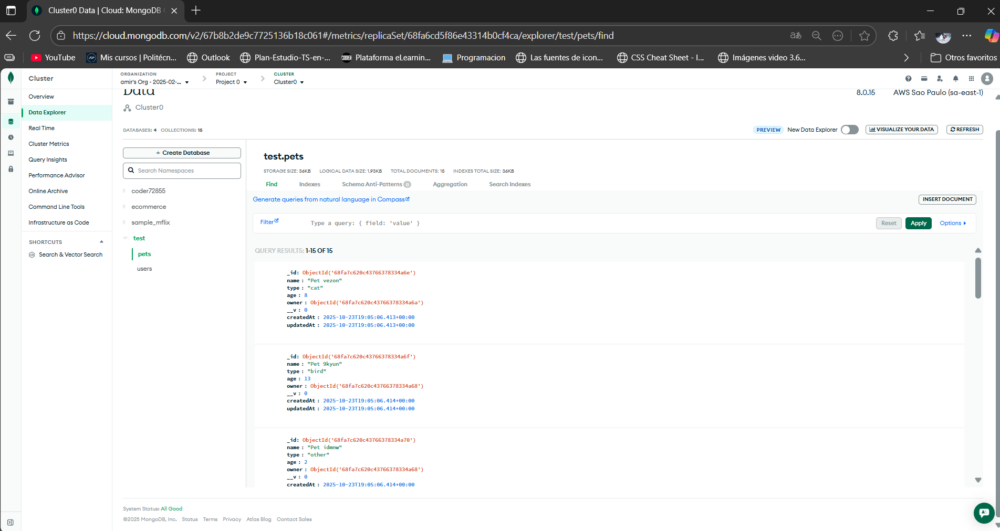
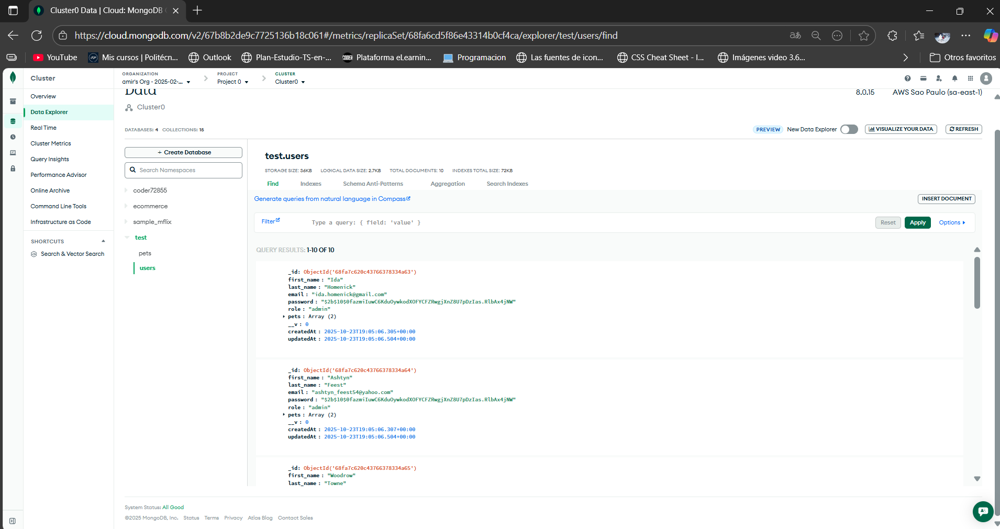

# 🐶🐱 Proyecto Backend III – Mocking, Adopciones, Tests y Docker

Este proyecto corresponde a las **Entregas N°1 y N°2** del curso **Backend III (Coderhouse)**. Incluye:

- Mocking de usuarios y mascotas
- Inserción masiva de datos
- CRUD de adopciones
- Documentación con Swagger
- Tests funcionales con Jest + Supertest
- Dockerfile, imagen Docker pública y ejecución vía DockerHub
- Uso de MongoDB Atlas + Mongoose

---

# 📌 Contenido

- Tecnologías utilizadas
- Estructura del proyecto
- Documentación con Swagger
- Endpoints principales
- Tests funcionales
- Docker
- Variables de entorno
- Instrucciones de ejecución
- Capturas de MongoDB
- Estado final de las entregas

---

# ⚙️ Tecnologías utilizadas

- Node.js
- Express
- MongoDB Atlas
- Mongoose
- Faker.js
- Bcrypt
- Dotenv
- Jest
- Supertest
- Swagger UI + swagger-jsdoc
- Docker

---

# 📁 Estructura del proyecto

```
src/
├─ models/
│  ├─ pet.model.js
│  ├─ user.model.js
│  └─ adoption.model.js
├─ routes/
│  ├─ mocks.router.js
│  ├─ pets.router.js
│  ├─ users.router.js
│  └─ adoption.router.js
├─ utils/
│  └─ mocking.js
├─ test/
│  └─ adoption.test.js
├─ app.js
├─ app.testing.js
Dockerfile
.env
package.json
README.md
imagenes_mongo/
```

---

# 📘 Documentación con Swagger

La documentación del módulo **Users** está disponible en:

👉 http://localhost:3000/api/docs

Ejemplo de anotación usada:

```js
/**
 * @openapi
 * /api/users:
 *   get:
 *     tags:
 *       - Users
 *     summary: Obtener todos los usuarios
 *     responses:
 *       200:
 *         description: Lista de usuarios obtenida correctamente
 */
```

---

# 🚀 Endpoints principales

## `/api/mocks/mockingpets`
Genera mascotas de ejemplo sin guardarlas en la base.

## `/api/mocks/mockingusers`
Genera **50 usuarios mock** con contraseña encriptada, rol aleatorio y pets vacío.

## `/api/mocks/generateData` (POST)
Genera e inserta usuarios y mascotas.

Ejemplo:
```json
{
  "users": 20,
  "pets": 30
}
```

## `/api/adoption`
- POST → Crear adopción
- GET → Obtener todas las adopciones

---

# 🧪 Tests funcionales

Desarrollados con **Jest + Supertest**.

Incluyen:
- Test de creación de adopción
- Test de obtención de adopciones
- Base de datos de pruebas con `MONGO_URL_TEST`
- Limpieza automática de datos

Ejecutar tests:
```
npm test
```

---

# 🐳 Docker

Este proyecto está dockerizado con un Dockerfile listo para producción.

### Dockerfile:
```dockerfile
FROM node:18
WORKDIR /app
COPY package*.json ./
RUN npm install
COPY . .
EXPOSE 3000
CMD ["npm", "start"]
```

---

# 🐳 Imagen Docker pública

Disponible en DockerHub:

👉 https://hub.docker.com/r/amirkalasnicoy/proyecto-backend-iii

## Ejecutar con Docker

1️⃣ Descargar la imagen:
```
docker pull amirkalasnicoy/proyecto-backend-iii
```

2️⃣ Ejecutar el contenedor:
```
docker run -p 3000:3000 amirkalasnicoy/proyecto-backend-iii
```

Disponible en:
- http://localhost:3000
- http://localhost:3000/api/docs

---

# 🔐 Variables de entorno

Archivo `.env` requerido:

```
PORT=3000
MONGO_URL=<cadena MongoAtlas>
MONGO_URL_TEST=<cadena MongoAtlas de testing>
```

---

# ▶️ Instrucciones de ejecución (sin Docker)

Instalar dependencias:
```
npm install
```

Ejecutar servidor:
```
npm start
```

Modo desarrollo:
```
npm run dev
```

---

# 📸 Capturas de MongoDB

## Pets


## Users


---

